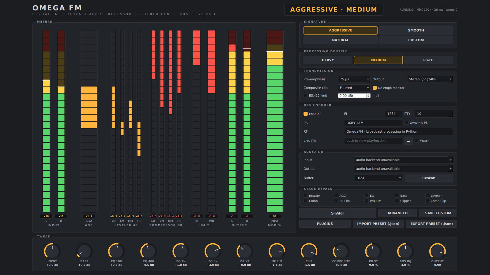
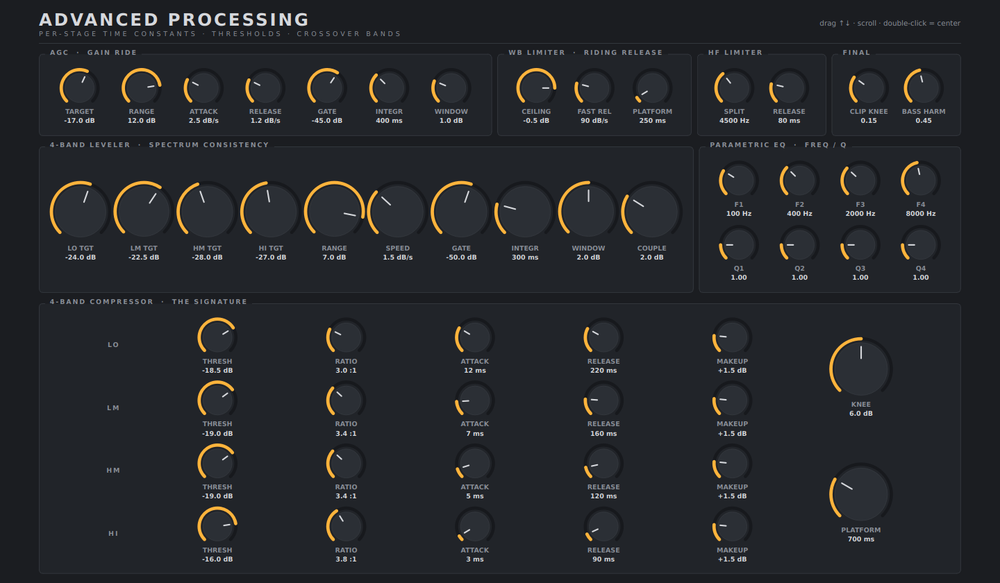
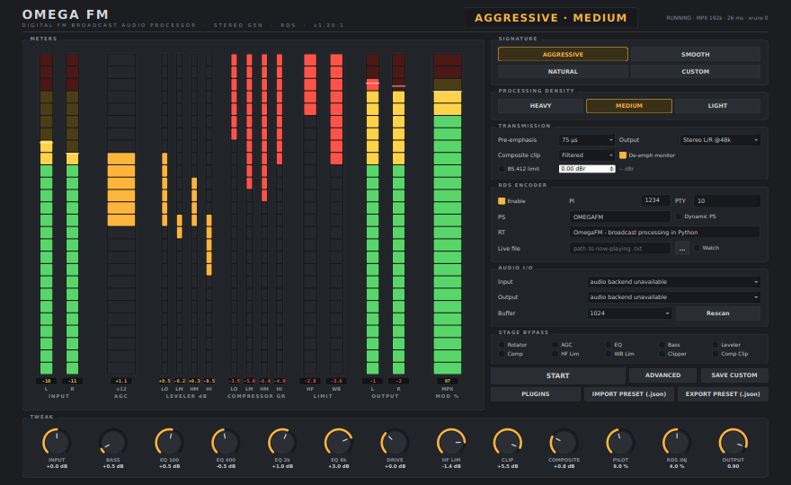
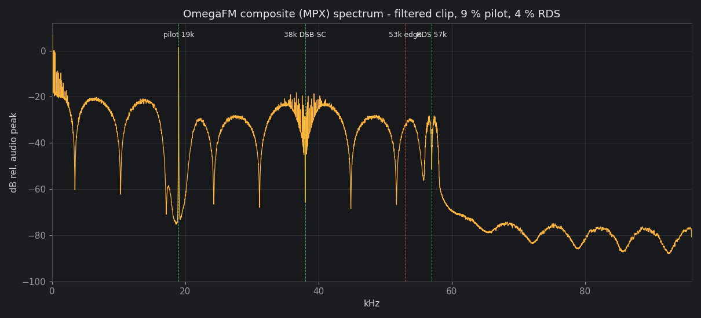

# OmegaFM

A software clone of the **Inovonics OmegaFM** FM broadcast audio
processor, written in Python. It is built like real broadcast gear —
a complete filtering and dynamics chain, an all-digital stereo/MPX
generator, and a standards-compliant RDS encoder — behind a classic
hardware front panel that scales to any screen.



## The processing chain (why it sounds good)

Audio is processed at **48 kHz** in the multiband section, then
**4x-oversampled to 192 kHz** for everything that shapes peaks:

```
IN -> input gain -> phase rotator (Optimod-style, 4x AP @200 Hz)
   -> broadcast-grade gated slow AGC (fast-detector gate that
      freezes gain AND its loudness integrator rock-solid across gaps,
      single-speed slew - rides identically at any input drive, never
      pumps) (±12 dB gain riding)
   -> 4-band parametric EQ (100 / 400 / 2k / 8k)
   -> psycho-acoustic bass (sub harmonics + low shelf; factory presets
      keep total LF EQ boost <= 1 dB - perceived bass comes from the
      harmonics, not from level)
   -> Linkwitz-Riley 4 crossover @ 160 / 1k / 5k  (allpass-compensated,
      band sum verified flat to < 0.01 dB)
   -> 4-band spectrum-consistency leveler: true 300 ms integrated
      loudness detection, ±2 dB correction window, and *mix-protected*
      correction - the bands are zero-mean (net gain always 0 dB; the
      AGC owns level) and coupled to within ±2 dB of the pack, so it
      corrects spectral shape gently and can never repaint a mix
      (validated on strings-dominant classical: no band fades, no bass
      creep, ≤4 dB total shape authority)
   -> 4-band soft-knee compressor (the "signature") with
      program-dependent release: GR releases only down to a slowly
      gliding platform, never collapsing to unity between hits
   -> band mix -> drive
   == 4x polyphase upsample to 192 kHz ==
   -> true bilinear 75/50 µs pre-emphasis (accurate to 0.02 dB @ 15 kHz)
   -> dynamic HF limiter (protects the emphasized top end)
   -> wideband look-ahead limiter (2 ms LA, gain-riding release:
      a platform that charges down in ~0.25 s and bleeds up at only
      0.8 dB/s, with a ~90 dB/s fast return *to the platform*)
   -> soft-knee clipper (loudness)
   -> 15 kHz linear-phase brick-wall (Kaiser, >80 dB) - pilot protection
   -> safety clip
```

**Stereo generator** — one phase accumulator drives the 19 kHz pilot,
the 38 kHz DSB-SC subcarrier (`sin 2θ`) and the 57 kHz RDS carrier
(`sin 3θ`), so all three are phase-locked by construction.
The **filtered composite clipper** clips only the audio MPX, band-limits
the clip *products* with a linear-phase 53 kHz LP + 19 kHz notch mask,
then injects pilot and RDS *after* the mask using a delay-compensated
phase — measured **stereo separation: 75 dB** through the full composite
path (hardware spec: > 65 dB). A "raw" mode (clip everything, then LP)
and "off" are on the panel too.

**RDS encoder** — real EN 50067 groups: 0A (PS, DI stereo, no-AF) and
2A (64-char RadioText with A/B flip), CRC-10 checkwords with offset
words, differential + biphase coding, raised-cosine (β = 1) pulse
shaping placed at exact fractional-sample symbol instants. PS refreshes
~0.7 s, RT ~2.8 s. A watched *now-playing* text file can update RT/PS
live (`RT=...` / `PS=...` lines, or plain text → RT), with optional
Dynamic PS that rotates the RadioText through the 8-character PS field.

**The whole gain chain rides - including the compressor.** Every
release in the dynamics chain returns to a platform, not to unity: the
multiband compressor holds 87 % of its working GR through the gaps in
percussive material and the WB limiter holds 89 % (both validated), so
the final limiter glides *with* the compressor instead of grabbing on
every syllable - while the attack shaping (the density character) is
untouched.

 The AGC and per-band leveler measure
true integrated loudness (power-domain 300–400 ms ballistics) and only
correct outside a deadband window around target, so their gains hold
perfectly still through percussive material (validated: < 0.1 dB of
per-hit motion on snare bursts) and glide only with the passage.

**Gain staging follows the Omega philosophy**: the *leveler* does the
heavy lifting, so the multiband compressor only rides a gentle sweet
spot instead of the 10–15 dB grind of conventional broadcast chains —
factory presets are centered on a station-tuned AGGRESSIVE·LIGHT
reference (bright, open-top FM voicing: near-flat leveler shape,
light HM/HI compression, transients handed to the final limiters,
loudness from the clippers) and calibrated against *dense mastered
music* (a CD-loudness surrogate is part of the test suite) and land at ≈ 1.5–2 dB
(LIGHT), ≈ 3–4 dB (MEDIUM) and ≈ 5 dB (HEAVY) of per-band GR, balanced
across bands, with the leveler idling near centre instead of railing. The final WB/HF limiters catch only transients (mean
well under 1 dB, peaks 3–4 dB) and loudness compensation comes from the
baseband and composite clippers, not from compression depth. The WB limiter's release *rides*: brief peaks recover fast
back to a slowly-moving platform gain instead of pumping to unity
between words or beats (the validator proves 59 % of the working GR is
held through gaps; after the platform unification it holds 89 %).

Latency of the whole DSP chain is **≈ 4.3 ms** (plus the audio buffer).

## The interface

No menus. Four **SIGNATURE** buttons (Aggressive / Smooth / Natural /
Custom) × three **DENSITY** buttons (Heavy / Medium / Light) = the 12
presets. LED bargraphs for every stage (input, AGC ride, per-band
leveler ±, per-band compressor GR, HF/WB limiting, output, MPX
modulation %), per-stage bypass, device/buffer selection, RDS panel,
and a TWEAK bar of thirteen knobs (drag ↑↓, scroll, double-click to
center). The **ADVANCED** button opens a second window with the deep
engineering controls — per-band compressor thresholds / ratios /
attacks / releases / makeup + knee + release platform, leveler band
targets, speed,
integration time and window, all AGC constants (incl. integration and
window), EQ frequencies and Qs, HF-limiter split & release, and
the WB limiter's ceiling / fast-release / platform time. "SAVE CUSTOM"
stores your tweaks into the CUSTOM signature; everything persists to
`~/.omegafm/config.yaml`.

**BS.412 MPX power limiter** — the European regulatory loudness
governor, opt-in in the output section. Measures true composite power
against the 19 kHz-deviation reference and rides only the audio part
of the MPX (pilot and RDS injection are constitutionally untouched -
verified to 0.000 dB), holding the honest sliding 60 s figure the
regulator measures at the TARGET (default 0 dBr, with hysteresis so
the gain glides instead of hunting). The readout lives next to the
control and stays live even when limiting is off; enable and target
persist as station setup like RDS. Note: enabling it costs loudness -
that is its entire legal purpose.

**8100-reference final section** — the clip stage follows the classic
Orban architecture: cubic soft clip, then the clipped-away difference
below 1.7 kHz is added back phase-aligned (bass passes UNCLIPPED -
fat, not crunchy), the 15 kHz brickwall, two passes of band-limited
phase-aligned overshoot rounding, and a final stage that only ever
touches sub-0.2 dB crumbs. Pre-emphasis carries the analog network's
20 kHz pole (without it the boost rises without limit - the classic
'harsh digital pre-emphasis' mistake). The HF limiter applies its gain
as a dynamic 3.2 kHz shelf plus 15 % broadband, so it reads as program
tilt, not a band being ducked. The phase rotator is four staggered
first-order sections (120-210 Hz) with its own bypass in ADVANCED.

**Performance** — the gain-riding control loops JIT-compile through
Numba when installed (`pip install numba` - optional, pure-Python
fallback otherwise) and the garbage collector is parked while
streaming. Worst-case block time measured 15 ms against a 21 ms
budget with the full factory rack.

**Distortion-controlled clipper** — the clip stage is the big-iron
kind: bass is pre-clipped off the rail on its own leg, the clip
difference is split so bass/mid products (clean loudness) stay while
HF products (audible sibilant 'spit') are suppressed, and the main
clip runs with overshoot headroom under the 15 kHz brickwall so the
post-filter safety never hard-shears the filter ring. Measured on a
worst-case continuous-sibilance torture probe: odd-order IMD at the
factory drive improved from a -24.6 dBc hard floor (unfixable by any
clipper setting) to -27.4 dBc, reaching -43.7 at moderate drive, with
loudness within 1 % and MPX peaks intact.

**Power-on default** — every launch boots into the station-tuned
factory default: the full nine-module rack (repair, enhancement and
governance, operator calibrated) plus the reference sound
— AGGRESSIVE · LIGHT (shipped as
`presets/factory_default.json` too), so the app always comes up in the
exact validated state. Only station identity and local setup persist
between sessions - RDS, injection levels, I/O trims, device and buffer
choices. Your sound lives in preset files: IMPORT one after boot.
Repair plugins (de-clipper, dehummer) include a TEST knob that
simulates their target damage so you can hear and meter them working
on any source - never leave TEST on for air.

**Preset files** — IMPORT / EXPORT buttons read and write portable
JSON presets, applied live. Presets carry the **plugin rack** too:
which plugins are enabled and every knob value — importing a preset
reproduces the complete sound including its modules (plugins not named
by the preset are disabled; files from before this feature leave the
rack untouched). A preset is the *sound only*: the whole
processing chain including bypasses, EQ, all dynamics constants and
clipper drive. Station identity and local setup (RDS text/PI, pre-
emphasis region, input gain, output level, pilot & RDS injection) are
deliberately excluded so importing someone else's sound never clobbers
your station. Files carry a format tag + version; on import unknown
keys are ignored, missing keys fall back to defaults, every value is
type-checked and clamped to safe DSP ranges — a hand-edited file can't
blow up a filter. Round-trips are exact (validated), the exported
DENSITY comes along but stays a *live* dimension afterward, and the
imported preset's name lights up on the front-panel lamp.



**Fully scalable canvas** — the panel is drawn at a 1600×900 reference
inside a `QGraphicsView` that re-fits it (aspect-locked) on every
resize. On any window or screen size the *entire* interface simply
scales; nothing ever clips:

| 1600×900 | 880×540 |
|---|---|
|  |  |


## DSP plugins (modular chain extensions)

The validated core chain never needs rebuilding to grow: drop a single
`.py` file into `plugins/` (or `~/.omegafm/plugins/`), press
**PLUGINS** on the panel, tick it, and it is inserted **live** into the
running chain at the point it declares. A plugin file is ordinary
Python with a declarative manifest:

```python
PLUGIN = {
  "id": "stereo_widener", "name": "Stereo Widener", "version": "1.0",
  "insert": "post_input",          # post_input / post_agc / post_eq /
                                   # post_bass / post_multiband  (48 kHz stereo)
  "params": [{"key": "width", "label": "WIDTH", "min": 0, "max": 2,
              "default": 1.25, "fmt": "{:.2f}", "suffix": "x"}],
  "meters": [{"key": "corr", "label": "CORR", "mode": "bipolar",
              "lo": -1, "hi": 1}],
}

class Plugin:
    def __init__(self, fs, channels=2): ...
    def set_params(self, **kv): ...
    def process(self, x):            # float64 (N,2) in -> same shape out
        return x
```

The **CONTROLS** button opens the plugin's own window - knobs and LED
meters are auto-generated from the manifest and read the running
instance live. Enable state and knob values persist across sessions.

**The core is protected**: every plugin call is sandboxed - on any
exception or wrong output shape the plugin is instantly auto-bypassed
with its traceback shown in the list, and audio continues untouched
through the validated chain (this containment is itself a validation
check). A working **Stereo Widener** ships as the reference example:
mid/side WIDTH with a MONO< bass-mono guard and a live L/R correlation
meter.

## Install & run

```bash
pip install -r requirements.txt
python run_omegafm.py
```

Input and output run as **independent streams**, so any input device
works with any output device (different drivers / host APIs are fine),
each side honours its own selection or its own system default, and the
status bar shows the *resolved* device names while running. In MPX mode
only the *output* runs at 192 kHz - the input stays at native 48 kHz.
A small FIFO (2-block prefill) joins the two clocks; sustained clock
drift between cheap devices is absorbed by drop-oldest and counted as
an xrun.

Pick input/output devices, choose **Stereo L/R @48k** (normal listening
— the monitor is de-emphasized so it sounds flat) or **MPX composite
@192k**, press **START**.

* **MPX mode needs a true 192 kHz interface** whose output is flat to
  ~60 kHz, feeding an FM exciter's composite input. Consumer DACs often
  roll off above ~20 kHz and will kill the 57 kHz RDS subcarrier.
* On Windows, ASIO devices are tagged in the device list
  (`pip install sounddevice` includes ASIO support via PortAudio).
* Buffer sizes: 256 / 512 / 1024 (default) / 2048.

## Validation

```bash
python tools/validate_chain.py          # 18 automated checks + MPX spectrum plot
QT_QPA_PLATFORM=offscreen python tools/render_ui.py   # panel screenshots
```

The validator proves: crossover flatness, pre-emphasis accuracy vs the
analog curve, RDS CRC integrity, gain-riding/GR behaviour on program
material, ≤ 100 % modulation, pilot/RDS placement and >45 dB
out-of-band suppression in the Welch spectrum, that the WB/HF limiters
only tickle while loudness is kept, that the WB release rides its
platform instead of pumping word-to-word, that the leveler holds still
through snare-like hits, DSP latency < 10 ms, and 75 dB decoded stereo
separation.



## Layout

```
omegafm/
  dsp/filters.py       biquads, LR4 crossover, pre-emphasis, FIR designs
  dsp/dynamics.py      look-ahead limiter, HF limiter, AGC/leveler, comp, clippers
  dsp/resample.py      polyphase 4x up/down converters
  processing_chain.py  FrontChain48 + FinalSection192
  stereo_generator.py  MPX generator + composite clipper + pilot/RDS injection
  rds.py               EN 50067 encoder
  params.py            defaults, signatures x densities, thread-safe store
  processor.py         sounddevice engine (stereo & MPX modes), Controller
  meters.py, config.py, ui.py, main.py
tools/
  validate_chain.py    offline proof of the whole chain
  render_ui.py         offscreen screenshots (scaling demo)
```
